# 🏪 VideoSat POS Sistemi - Çalışma Mantığı ve İş Akışı

## 👤 Proje Sahibi
**Gül Naz Demir**  
**2024**

---

## 🎯 POS SİSTEMİ GENEL YAPISI

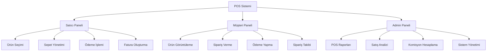

---

## 🔄 POS SİSTEMİ İŞ AKIŞI ŞEMASI

### 📱 Satıcı Tarafı İş Akışı

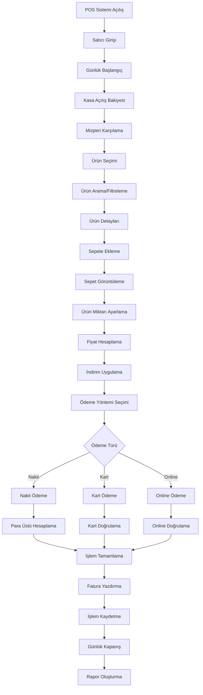

### 🛒 Müşteri Tarafı İş Akışı

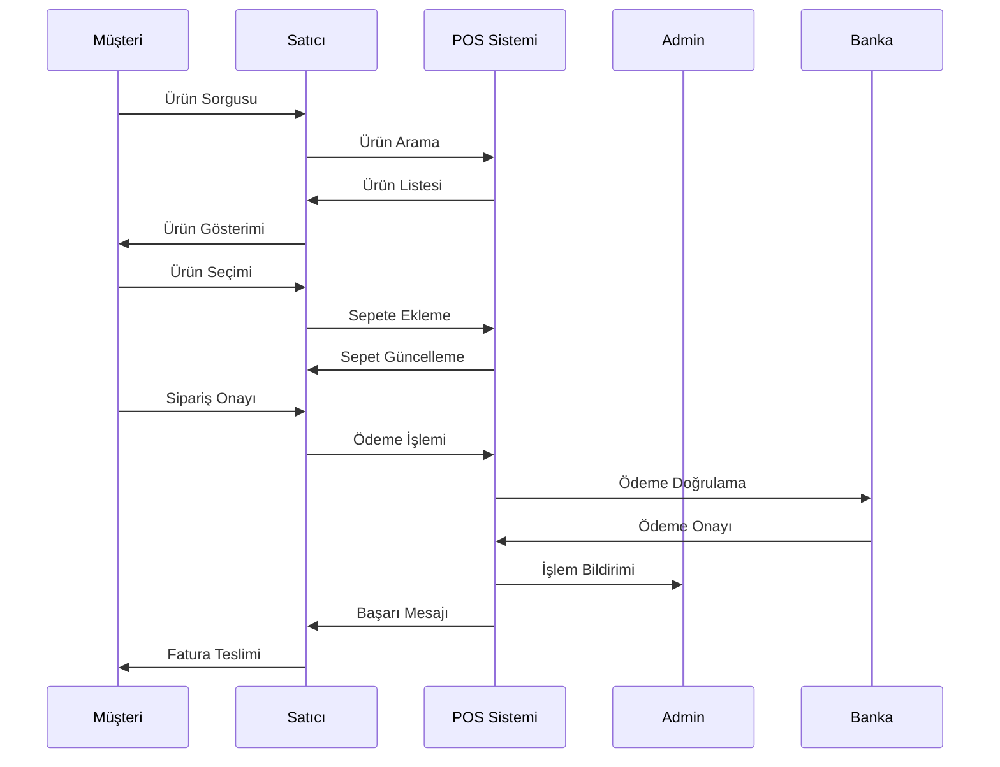

---

## 💰 ÖDEME SİSTEMİ DETAYLARI

### 🏦 Ödeme Yöntemleri

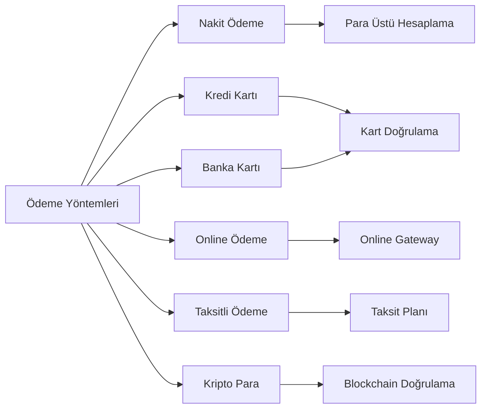

### 💳 Ödeme İşlem Süreci

#### **1. Nakit Ödeme**
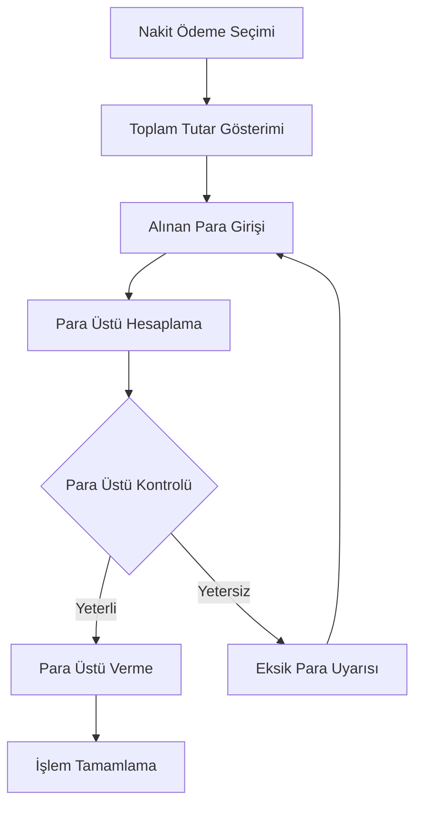

#### **2. Kart Ödeme**
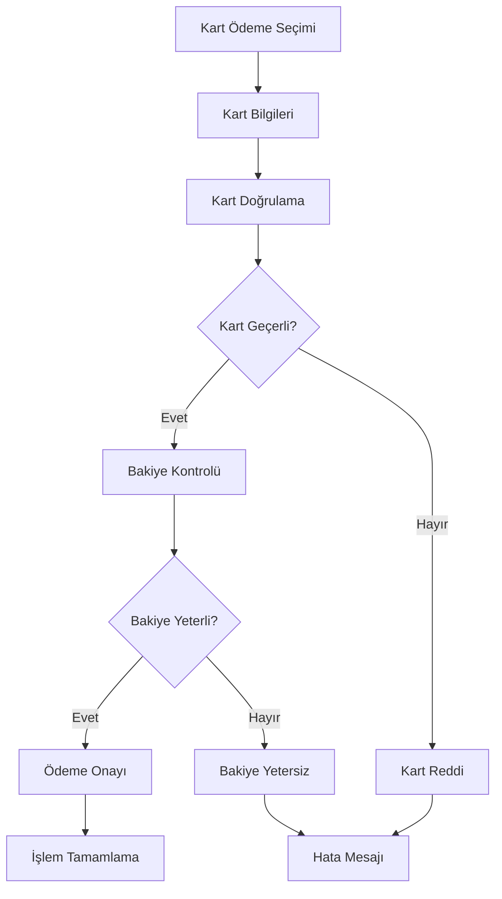

---

## 📊 POS RAPORLAMA SİSTEMİ

### 📈 Günlük Raporlar

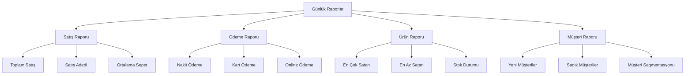

### 📋 Rapor Detayları

#### **Satış Raporu**
- Toplam satış tutarı
- Satış adedi
- Ortalama sepet tutarı
- Saatlik satış dağılımı
- Ürün bazlı satış analizi

#### **Ödeme Raporu**
- Ödeme yöntemi dağılımı
- Nakit/kart oranı
- Başarısız ödeme sayısı
- Ortalama ödeme süresi

#### **Ürün Raporu**
- En çok satan ürünler
- En az satan ürünler
- Stok durumu
- Ürün kategorisi analizi

#### **Müşteri Raporu**
- Yeni müşteri sayısı
- Sadık müşteri analizi
- Müşteri segmentasyonu
- Müşteri memnuniyet skoru

---

## 🛍️ SEPET YÖNETİMİ SİSTEMİ

### 🛒 Sepet İşlemleri

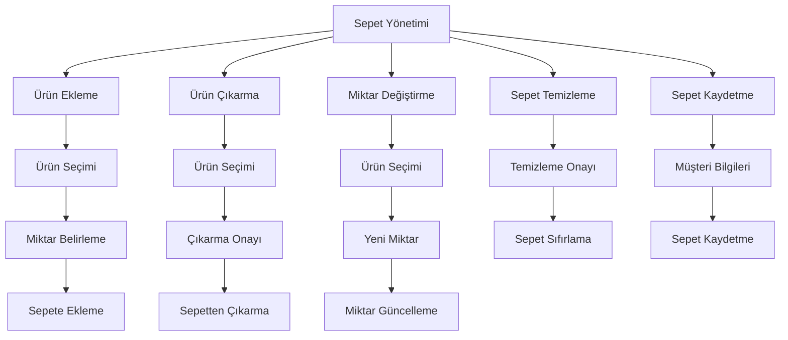

### 💰 Fiyat Hesaplama Mantığı

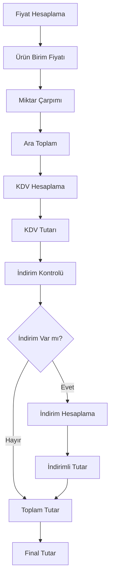

---

## 🎯 İNDİRİM VE KAMPANYA SİSTEMİ

### 🏷️ İndirim Türleri

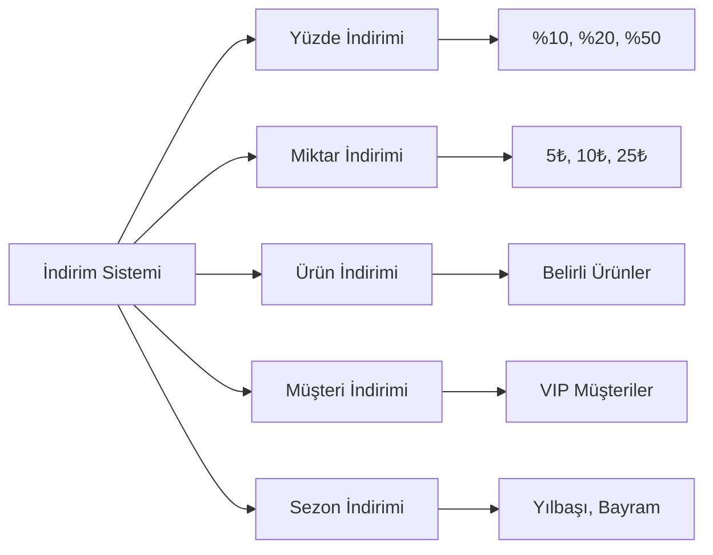

### 🎁 Kampanya Mantığı

#### **Otomatik İndirim Kuralları**
- 100₺ üzeri alışverişte %5 indirim
- 5 adet üzeri alışverişte %10 indirim
- VIP müşterilere %15 indirim
- İlk alışverişte %20 indirim

#### **Manuel İndirim**
- Satıcı tarafından özel indirim
- Müşteri memnuniyeti indirimi
- Hata düzeltme indirimi
- Promosyon indirimi

---

## 📱 MOBİL POS ENTEGRASYONU

### 📲 Mobil Uygulama Özellikleri

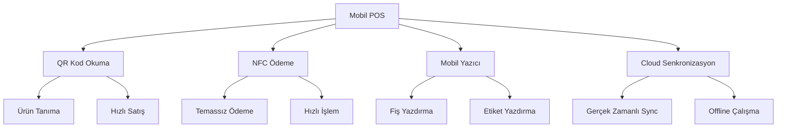

### 🔄 Offline/Online Çalışma

#### **Online Mod**
- Gerçek zamanlı stok güncelleme
- Anlık ödeme doğrulama
- Cloud backup
- Gerçek zamanlı raporlama

#### **Offline Mod**
- Yerel veritabanı kullanımı
- Ödeme sonrası doğrulama
- Senkronizasyon bekletme
- Offline raporlama

---

## 🔐 GÜVENLİK VE YETKİLENDİRME

### 🛡️ POS Güvenlik Katmanları

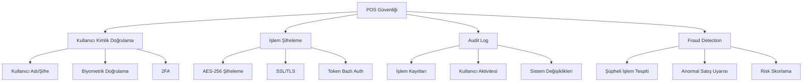

### 👥 Yetkilendirme Seviyeleri

#### **Satıcı Yetkileri**
- Ürün satışı
- İndirim uygulama (%10'a kadar)
- Müşteri bilgileri görüntüleme
- Günlük rapor görüntüleme

#### **Şef Satıcı Yetkileri**
- Tüm satıcı yetkileri
- Yüksek indirim uygulama (%25'e kadar)
- İade işlemleri
- Haftalık rapor görüntüleme

#### **Müdür Yetkileri**
- Tüm şef yetkileri
- Sınırsız indirim
- Sistem ayarları
- Tüm raporları görüntüleme

---

## 📊 PERFORMANS VE OPTİMİZASYON

### ⚡ Sistem Performansı

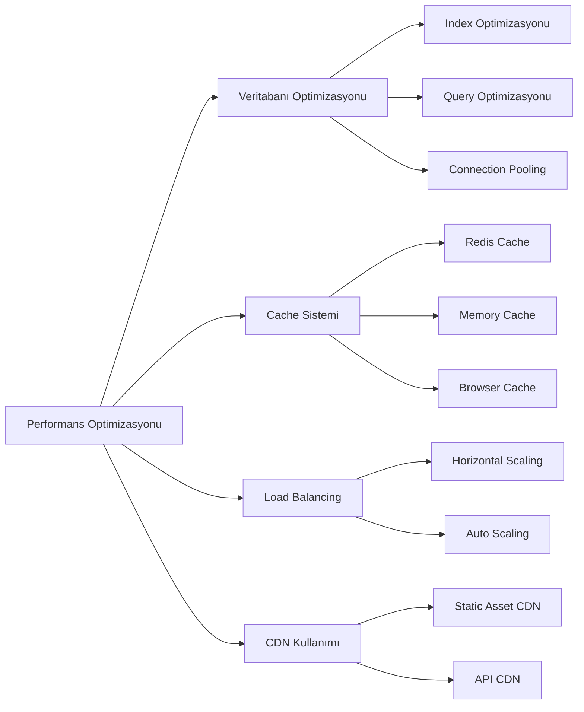

### 📈 Performans Metrikleri

#### **Yanıt Süreleri**
- Ürün arama: < 200ms
- Sepet güncelleme: < 100ms
- Ödeme işlemi: < 2 saniye
- Rapor oluşturma: < 5 saniye

#### **Sistem Kapasitesi**
- Eş zamanlı kullanıcı: 1000+
- Günlük işlem: 10,000+
- Veritabanı boyutu: 100GB+
- Uptime: %99.9

---

## 🚨 HATA YÖNETİMİ VE KURTARMA

### ⚠️ Hata Senaryoları

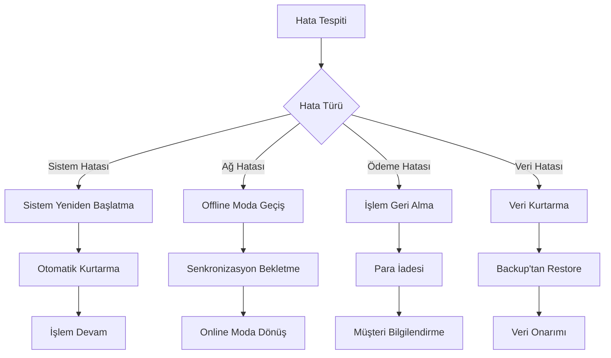

### 🔄 Backup ve Kurtarma

#### **Otomatik Backup**
- Her 15 dakikada bir veri backup
- Günlük tam backup
- Haftalık arşiv backup
- Cloud backup entegrasyonu

#### **Kurtarma Senaryoları**
- Sistem çökmesi kurtarma
- Veri kaybı kurtarma
- Donanım arızası kurtarma
- Siber saldırı kurtarma

---

## 📞 MÜŞTERİ HİZMETLERİ ENTEGRASYONU

### 🎯 Müşteri Destek Sistemi

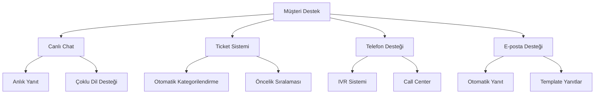

### 📋 Destek Senaryoları

#### **POS İşlem Sorunları**
- Ödeme başarısızlığı
- Fiş yazdırma sorunu
- Ürün bulunamama
- Sistem yavaşlığı

#### **Müşteri Şikayetleri**
- Yanlış fiyatlandırma
- Eksik ürün teslimatı
- Hatalı fatura
- Kötü hizmet

---

## 🔄 SÜREKLİ İYİLEŞTİRME VE GÜNCELLEME

### 📊 Veri Analizi ve İyileştirme

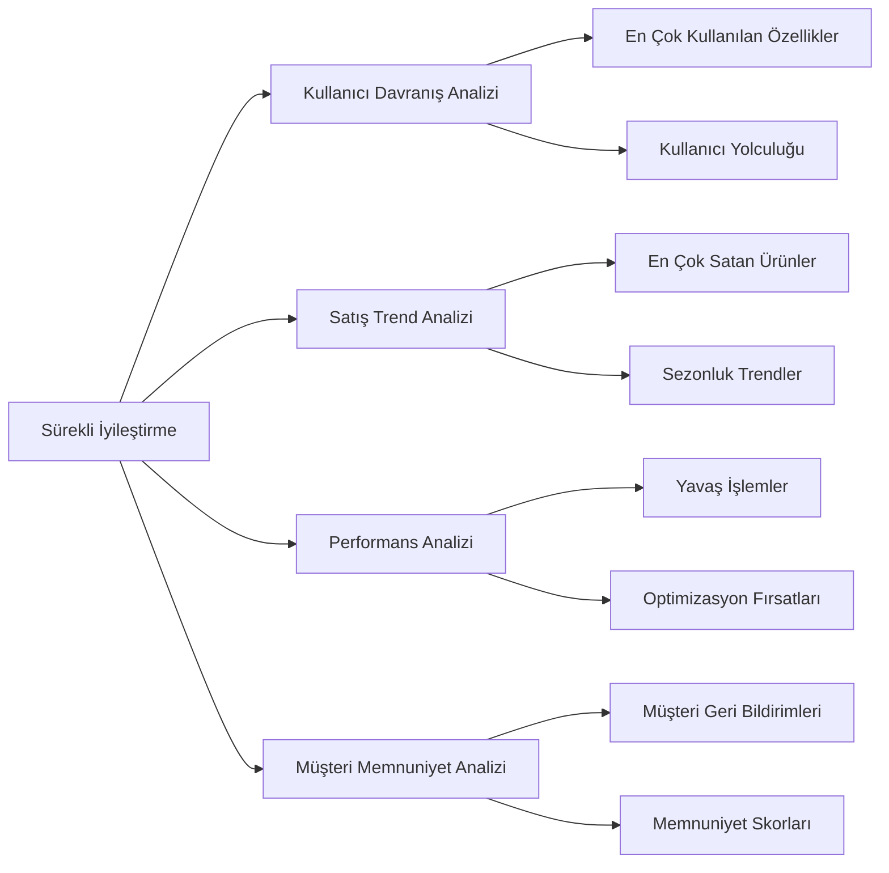

### 🚀 Güncelleme Stratejisi

#### **Otomatik Güncellemeler**
- Güvenlik yamaları
- Performans iyileştirmeleri
- Bug düzeltmeleri
- Küçük özellik güncellemeleri

#### **Manuel Güncellemeler**
- Büyük özellik güncellemeleri
- UI/UX değişiklikleri
- Sistem mimarisi değişiklikleri
- Entegrasyon güncellemeleri

---

## 📋 POS SİSTEMİ CHECKLİST

### ✅ Kurulum Checklist

- [ ] POS terminali kurulumu
- [ ] Yazıcı bağlantısı
- [ ] Barkod okuyucu kurulumu
- [ ] Ödeme terminali kurulumu
- [ ] Ağ bağlantısı testi
- [ ] Kullanıcı hesapları oluşturma
- [ ] Ürün veritabanı yükleme
- [ ] Test işlemleri

### ✅ Günlük İşlem Checklist

- [ ] Kasa açılış bakiyesi
- [ ] Sistem sağlık kontrolü
- [ ] Yazıcı testi
- [ ] Ödeme terminali testi
- [ ] Günlük satış hedefi
- [ ] Kasa kapanış bakiyesi
- [ ] Günlük rapor oluşturma
- [ ] Veri backup kontrolü

### ✅ Haftalık Bakım Checklist

- [ ] Sistem performans analizi
- [ ] Güvenlik güncellemeleri
- [ ] Veritabanı optimizasyonu
- [ ] Log dosyaları temizleme
- [ ] Backup testi
- [ ] Kullanıcı geri bildirimleri
- [ ] Satış trend analizi
- [ ] Sistem kapasitesi kontrolü

---

## 📞 TEKNİK DESTEK VE İLETİŞİM

### 🎯 Destek Kanalları
- **Teknik Destek**: tech@videosat.com
- **POS Desteği**: pos@videosat.com
- **Acil Destek**: +90 (212) 555 0123
- **WhatsApp**: +90 (212) 555 0123

### ⏰ Destek Süreleri
- **7/24 Acil Destek**: Sistem arızaları
- **Çalışma Saatleri**: 09:00 - 18:00
- **Hafta Sonu**: 10:00 - 16:00
- **Resmi Tatiller**: Acil durumlar

---

**📅 Dokümantasyon Tarihi**: 2024  
**👤 Hazırlayan**: Gül Naz Demir  
**🔄 Son Güncelleme**: 28 Ekim 2024

---

## 🎯 ÖZET

Bu POS sistemi dokümantasyonu, VideoSat platformunun satış noktası işlemlerini kapsar. Sistem, modern POS gereksinimlerini karşılayacak şekilde tasarlanmış ve tüm iş süreçleri detaylı olarak açıklanmıştır.

**⚠️ ÖNEMLİ**: POS sistemi kritik bir bileşendir ve sürekli monitoring ve bakım gerektirir.