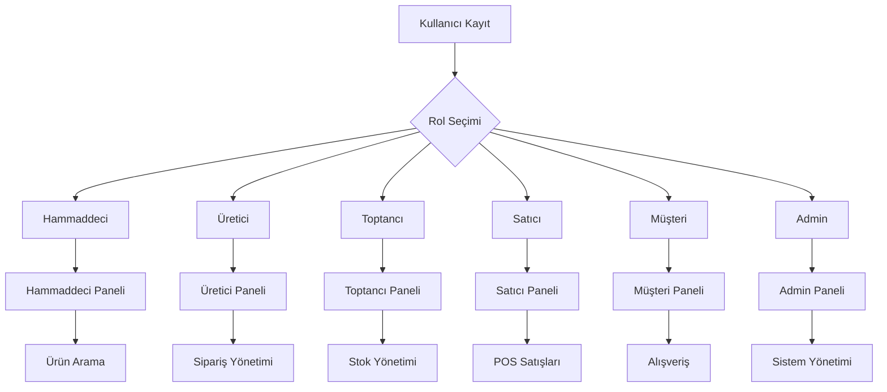
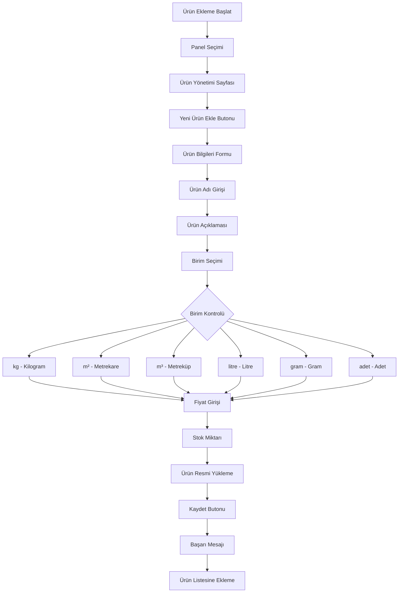
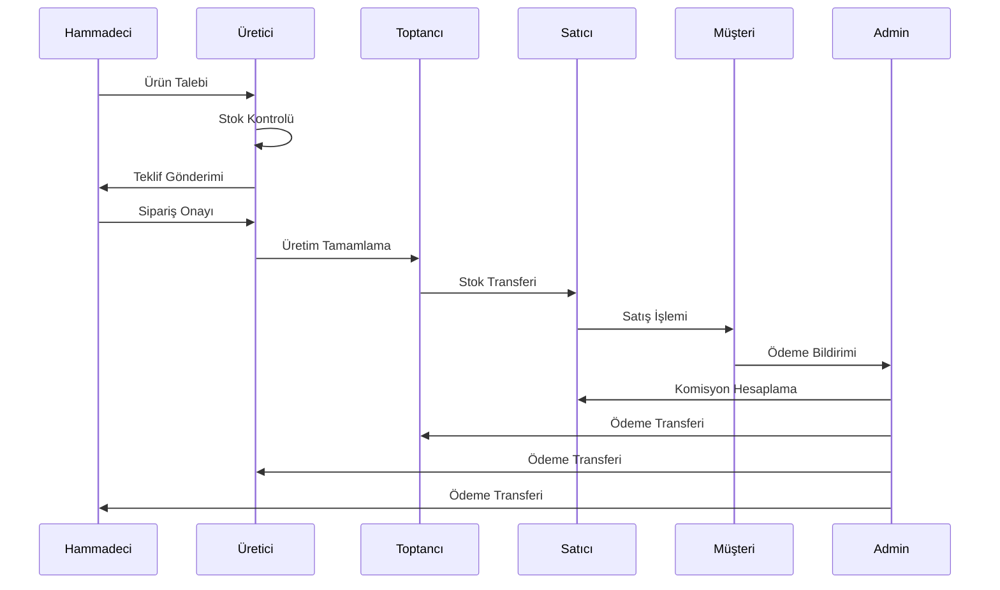
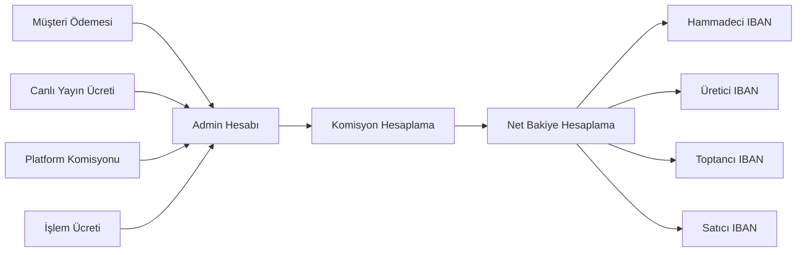
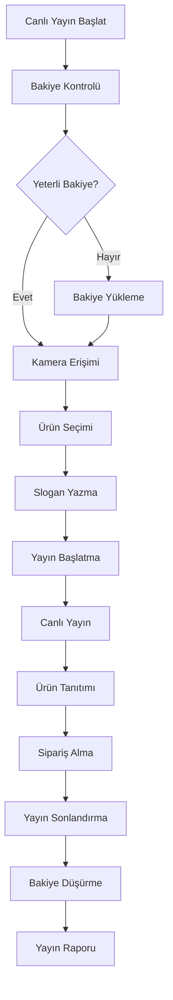
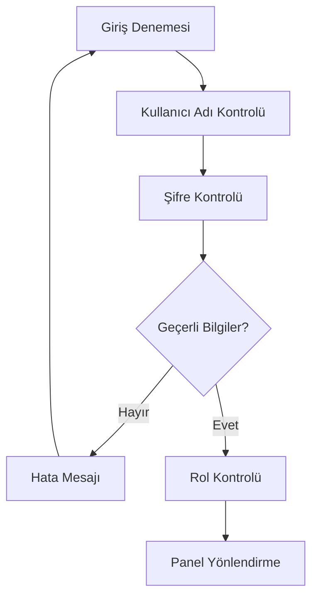

# 📋 VideoSat Platform - İş Akışı Prosedürleri

## 👤 Proje Sahibi
**Gül Naz Demir**  
**2024**

---

## 🎯 GENEL İŞ AKIŞI ŞEMASI



---

## 🔄 ÜRÜN EKLEME PROSEDÜRÜ

### ⚠️ KRİTİK KURAL
> **"ÜRÜN EKLEME PROSEDÜRÜ ... bu kuralı asla ama asla unutma."**

### 📝 Adım Adım Prosedür



### 📋 Detaylı Prosedür

#### 1. **Panel Erişimi**
- Kullanıcı kendi rolüne ait panele giriş yapar
- "Ürün Yönetimi" sekmesine tıklar
- "Yeni Ürün Ekle" butonuna basar

#### 2. **Ürün Bilgileri**
- **Ürün Adı**: Açık ve anlaşılır isim
- **Açıklama**: Detaylı ürün tanımı
- **Kategori**: Ürün kategorisi seçimi
- **Marka**: Ürün markası (varsa)

#### 3. **Birim Seçimi** (KRİTİK)
- **kg**: Kilogram (ağırlık)
- **m²**: Metrekare (alan)
- **m³**: Metreküp (hacim)
- **litre**: Litre (sıvı hacmi)
- **gram**: Gram (küçük ağırlık)
- **adet**: Adet (sayısal)

#### 4. **Fiyat ve Stok**
- **Birim Fiyat**: Seçilen birime göre fiyat
- **Stok Miktarı**: Mevcut stok durumu
- **Minimum Sipariş**: En az sipariş miktarı

#### 5. **Görsel Yükleme**
- Ürün fotoğrafı yükleme
- Çoklu görsel desteği
- Görsel optimizasyonu

---

## 🛒 SİPARİŞ YÖNETİMİ PROSEDÜRÜ



### 📋 Sipariş Süreci Detayları

#### **1. Talep Aşaması**
- Hammadeci ürün talebinde bulunur
- Üretici stok durumunu kontrol eder
- Teklif hazırlanır ve gönderilir

#### **2. Onay Aşaması**
- Hammadeci teklifi değerlendirir
- Sipariş onaylanır veya reddedilir
- Onaylanan siparişler üretim sürecine geçer

#### **3. Üretim Aşaması**
- Üretici siparişi hazırlar
- Kalite kontrol yapılır
- Toptancıya transfer edilir

#### **4. Satış Aşaması**
- Toptancı stok yönetimi yapar
- Satıcıya ürün transferi
- Müşteriye satış işlemi

#### **5. Ödeme Aşaması**
- Admin merkezi ödeme sistemi
- Komisyon hesaplaması
- Tüm taraflara ödeme transferi

---

## 💰 ÖDEME VE KOMİSYON PROSEDÜRÜ

### 🏦 Merkezi Ödeme Sistemi



### 📊 Komisyon Hesaplama Formülü

```
Toplam Gelir = Müşteri Ödemesi + Canlı Yayın Ücreti
Platform Komisyonu = Toplam Gelir × %5
İşlem Ücreti = Toplam Gelir × %2
Net Bakiye = Toplam Gelir - Platform Komisyonu - İşlem Ücreti

Hammadeci Payı = Net Bakiye × %20
Üretici Payı = Net Bakiye × %30
Toptancı Payı = Net Bakiye × %25
Satıcı Payı = Net Bakiye × %25
```

### 📅 Ödeme Takvimi

- **Günlük**: Acil ödemeler
- **Haftalık**: Normal ödemeler (Her Pazartesi)
- **Aylık**: Büyük ödemeler (Her ayın 1'i)
- **Özel**: Anlaşma bazlı ödemeler

---

## 🎥 CANLI YAYIN PROSEDÜRÜ



### 📋 Canlı Yayın Adımları

#### **1. Hazırlık Aşaması**
- Canlı yayın bakiyesi kontrolü
- Kamera ve mikrofon erişimi
- Ürün seçimi ve hazırlığı
- Slogan cümlelerinin hazırlanması

#### **2. Yayın Aşaması**
- Yayın başlatma
- Ürün tanıtımı
- Müşteri etkileşimi
- Sipariş alma

#### **3. Sonlandırma Aşaması**
- Yayın sonlandırma
- Bakiye düşürme
- Yayın raporu oluşturma
- Sipariş takibi

---

## 🔐 GÜVENLİK PROSEDÜRÜ

### 🛡️ Kimlik Doğrulama



### 🔒 Admin Güvenlik Prosedürü

#### **Admin Giriş Bilgileri**
- **E-posta**: admin@videosat.com
- **Şifre**: admin123
- **Alternatif**: ceo@videosat.com / ceo123

#### **Güvenlik Kontrolleri**
- Şifre karmaşıklığı kontrolü
- Oturum süresi sınırlaması
- IP adresi kayıtları
- Şüpheli aktivite bildirimleri

---

## 📊 RAPORLAMA PROSEDÜRÜ

### 📈 Günlük Raporlar
- Satış raporları
- Sipariş raporları
- Kullanıcı aktivite raporları
- Sistem performans raporları

### 📊 Haftalık Raporlar
- Gelir analizi
- Komisyon raporları
- Kullanıcı büyüme raporları
- Platform kullanım istatistikleri

### 📋 Aylık Raporlar
- Detaylı finansal raporlar
- Kullanıcı memnuniyet analizi
- Platform geliştirme önerileri
- Gelecek planları

---

## 🚨 ACİL DURUM PROSEDÜRÜ

### ⚡ Sistem Arızası
1. **Tespit**: Sistem arızası tespit edilir
2. **Bildirim**: Admin'e acil bildirim gönderilir
3. **Müdahale**: Hızlı müdahale ekibi devreye girer
4. **Çözüm**: Arıza giderilir
5. **Rapor**: Arıza raporu hazırlanır

### 🔐 Güvenlik İhlali
1. **Tespit**: Güvenlik ihlali tespit edilir
2. **İzolasyon**: Etkilenen sistemler izole edilir
3. **Analiz**: İhlal analizi yapılır
4. **Düzeltme**: Güvenlik açığı kapatılır
5. **Önlem**: Ek güvenlik önlemleri alınır

---

## 📞 İLETİŞİM PROSEDÜRÜ

### 🎯 Destek Kanalları
- **E-posta**: support@videosat.com
- **Telefon**: +90 (212) 555 0123
- **Canlı Destek**: Platform içi chat
- **WhatsApp**: +90 (212) 555 0123

### ⏰ Yanıt Süreleri
- **Acil**: 1 saat
- **Normal**: 24 saat
- **Genel**: 48 saat

---

## 📋 KALİTE KONTROL PROSEDÜRÜ

### ✅ Ürün Kalite Kontrolü
1. **Görsel Kontrol**: Ürün fotoğrafları
2. **Bilgi Kontrolü**: Ürün açıklamaları
3. **Fiyat Kontrolü**: Piyasa fiyat analizi
4. **Stok Kontrolü**: Mevcut stok durumu

### 🔍 Sistem Kalite Kontrolü
1. **Performans Testi**: Sayfa yükleme hızları
2. **Güvenlik Testi**: Güvenlik açığı taraması
3. **Kullanılabilirlik Testi**: Kullanıcı deneyimi
4. **Uyumluluk Testi**: Tarayıcı uyumluluğu

---

## 📚 EĞİTİM PROSEDÜRÜ

### 👥 Kullanıcı Eğitimi
- **Yeni Kullanıcı**: Platform tanıtımı
- **Rol Eğitimi**: Rol bazlı özellikler
- **Gelişmiş Özellikler**: İleri seviye kullanım
- **Güvenlik Eğitimi**: Güvenli kullanım

### 🎓 Personel Eğitimi
- **Teknik Eğitim**: Sistem yönetimi
- **Güvenlik Eğitimi**: Güvenlik protokolleri
- **Müşteri Hizmetleri**: Müşteri iletişimi
- **Sürekli Eğitim**: Güncellemeler

---

## 🔄 SÜREKLİ İYİLEŞTİRME PROSEDÜRÜ

### 📊 Veri Toplama
- Kullanıcı geri bildirimleri
- Sistem performans verileri
- Satış analizleri
- Kullanıcı davranış analizleri

### 🎯 İyileştirme Planlama
- Öncelik sıralaması
- Kaynak planlaması
- Zaman çizelgesi
- Başarı metrikleri

### ✅ Uygulama ve Takip
- İyileştirme uygulaması
- Sonuç takibi
- Performans ölçümü
- Geri bildirim toplama

---

## 📄 DOKÜMANTASYON PROSEDÜRÜ

### 📝 Dokümantasyon Türleri
- **Kullanıcı Kılavuzu**: Platform kullanımı
- **Teknik Dokümantasyon**: Sistem detayları
- **API Dokümantasyonu**: Geliştirici rehberi
- **Güvenlik Dokümantasyonu**: Güvenlik protokolleri

### 🔄 Güncelleme Süreci
- **İnceleme**: Mevcut dokümantasyon
- **Güncelleme**: Yeni bilgilerle güncelleme
- **Onay**: İlgili kişilerden onay
- **Yayınlama**: Güncel dokümantasyon yayını

---

**📅 Dokümantasyon Tarihi**: 2024  
**👤 Hazırlayan**: Gül Naz Demir  
**🔄 Son Güncelleme**: 28 Ekim 2024

---

## 🎯 ÖZET

Bu prosedür dokümantasyonu, VideoSat platformunun tüm iş süreçlerini kapsar. Her prosedür detaylı adımlarla açıklanmış ve görsel şemalarla desteklenmiştir. Platformun verimli ve güvenli çalışması için bu prosedürlere uyulması kritik önem taşımaktadır.

**⚠️ ÖNEMLİ**: Bu prosedürler sürekli güncellenmeli ve platform geliştikçe revize edilmelidir.